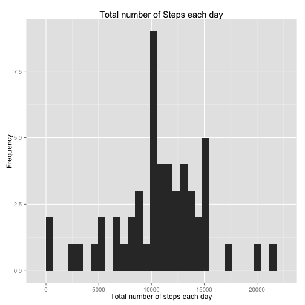
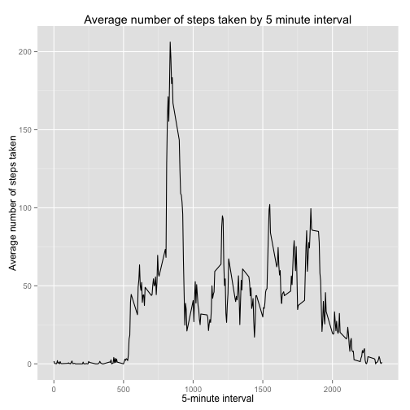
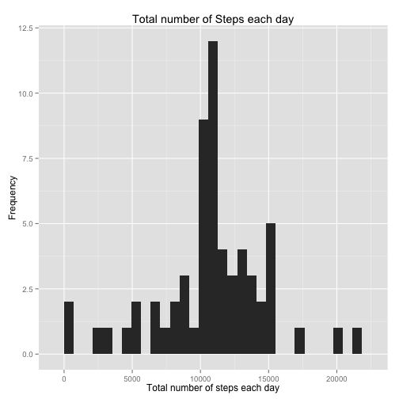
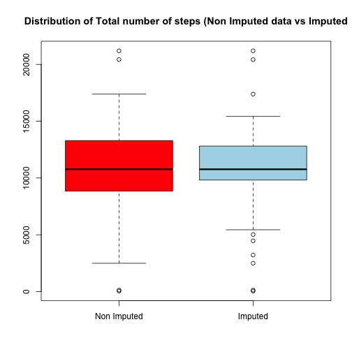
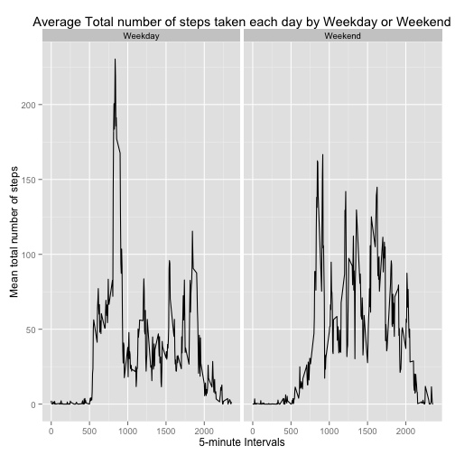

# Data Analysis   
# Activity dataset  
---

The variables included in this dataset are:

-*steps*: Number of steps taking in a 5-minute interval (missing values are coded as NA)  
-*date*: The date on which the measurement was taken in YYYY-MM-DD format  
-*interval*: Identifier for the 5-minute interval in which measurement was taken  
  
The dataset is stored in a comma-separated-value (CSV) file and there are a total of 17,568 observations in this dataset.

### Loading and processing the Data

Before analyzing any data, first we need to process the dataset obtained. Load the dataset in R using the *read.csv* command.

```r
act<- read.csv("activity.csv")
head(act)
```

```
##   steps       date interval
## 1    NA 2012-10-01        0
## 2    NA 2012-10-01        5
## 3    NA 2012-10-01       10
## 4    NA 2012-10-01       15
## 5    NA 2012-10-01       20
## 6    NA 2012-10-01       25
```

Is necesary for our data to be in the suitable format for our analysis. So we change the variable classes to factor and numerics. 

```r
act$steps<- as.numeric(act$steps)
act$date<- as.Date(act$date, format="%Y-%m-%d")
act$interval<- as.factor(act$interval)
```

### What is the mean total number of steps taken per day?

For this part of the analysis we are going to ignore the missing values in the dataset. It would be interesting to look at the distribution of total number of steps by day. For this we used a histogram, also we calculate the mean and median using the *summary* command.

```r
total.steps<- tapply(act$steps, act$date, sum)
library(ggplot2)
qplot(total.steps, main="Total number of Steps each day", ylab="Frequency", xlab="Total number of steps each day")
```

```
## stat_bin: binwidth defaulted to range/30. Use 'binwidth = x' to adjust this.
```

 

```r
summary(total.steps)
```

```
##    Min. 1st Qu.  Median    Mean 3rd Qu.    Max.    NA's 
##      41    8841   10760   10770   13290   21190       8
```

### What is the average daily activity pattern?

To look at the pattern we constructed a time series plot that showed us the average of total number of steps by 5-minute intervals across time.
Before constructing the graph we have to calculate the average.

```r
mean.interval<- tapply(act$steps, act$interval, mean, na.rm=TRUE)
interval.new<-unique(act$interval) 
average.interval<- data.frame(mean.interval, interval.new)
```

Now, we construct the timeseries plot.

```r
average.interval$interval.new<-as.numeric(as.character(average.interval$interval.new)) 
qplot(interval.new, mean.interval, data=average.interval, geom="line", main="Average number of steps taken by 5 minute interval", xlab="5-minute interval", ylab="Average number of steps taken")
```

 

It would be interesting to see what 5 minute intervals has the maximum total number of steps.

```r
summary(average.interval$mean.interval)
```

```
##    Min. 1st Qu.  Median    Mean 3rd Qu.    Max. 
##   0.000   2.486  34.110  37.380  52.830 206.200
```

```r
sub<- subset(average.interval, average.interval$mean.interval>=206)
sub
```

```
##     mean.interval interval.new
## 835      206.1698          835
```

## Imputing missing values
To impute data we need to create a new dataset we a new logical variable that tells us if any observation has a missing value. 

```r
miss<- complete.cases(act)
act.miss<-data.frame(act, miss)
```

Now, we impute the missing values using the average total number of steps by interval. Meaning that those values that are missing, are substituted with the total number of steps fot the respetive interval. Following is the code for the imputation. 

```r
for (i in 1:length(act$steps))  {
        if (act.miss[i,4]=="FALSE"){
            
            for (j in 1:length(average.interval$mean.interval)){
                if (average.interval[j,2] == act.miss[i,3]){
                  
                  act.miss[i,1]<-average.interval[j,1]
                }else{
                
                }
              
            }
          
        }else{
          
        }
}
```
Is important to verify if there are any missing values left. Although the variable is changed, we still need to double check.

```r
test<-complete.cases(act.miss)
table(test)
```

```
## test
##  TRUE 
## 17568
```

Take a look of the distribution of the Total number of steps each day using the imputed data.

```r
total.steps.miss<- tapply(act.miss$steps, act.miss$date, sum)
qplot(total.steps.miss, main="Total number of Steps each day", ylab="Frequency", xlab="Total number of steps each day")
```

```
## stat_bin: binwidth defaulted to range/30. Use 'binwidth = x' to adjust this.
```

 

```r
# Lets look at the difference in the imputed data vs none imputed data
summary(total.steps.miss)
```

```
##    Min. 1st Qu.  Median    Mean 3rd Qu.    Max. 
##      41    9819   10770   10770   12810   21190
```

```r
summary(total.steps)
```

```
##    Min. 1st Qu.  Median    Mean 3rd Qu.    Max.    NA's 
##      41    8841   10760   10770   13290   21190       8
```
Is more apeiling to the eye to see the effect of imputed data in a boxplot.

```r
boxplot(total.steps, total.steps.miss, main="Distribution of Total number of steps (Non Imputed data vs Imputed", names=c("Non Imputed","Imputed"), col=c("red","lightblue"))
```

 

### Are there differences in activity patterns between weekdays and weekends?
First we categorized the weekdays into two level variable: Weekday or Weekend. Calculate the average total number of steps by interval by if is Weekday or Weekend.

```r
library(timeDate)
weekday<- isWeekday(act.miss$date)
act.miss<-data.frame(act.miss,weekday)
act.miss$weekday<- factor(act.miss$weekday, level=c("TRUE","FALSE"), labels=c("Weekday", "Weekend"))
# Get the mean steps by interval by weekday or weekend
week.data<-aggregate(act.miss$steps, list(act.miss$interval, act.miss$weekday), mean)
# Before plotting we need to convert the intervals in a conitnous variable
week.data$Group.1<- as.numeric(as.character(week.data$Group.1))
ggplot(week.data, aes(Group.1, x)) + labs(title="Average Total number of steps taken each day by Weekday or Weekend", x="5-minute Intervals", y="Mean total number of steps") + geom_line() + facet_wrap(~Group.2)
```

 


